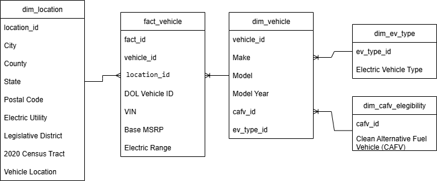

# Washington Electric Vehicle ETL Pipeline

This project contains an ETL pipeline for analyzing electric vehicles registered in Washington State. The goal is to prepare the dataset for loading into a data warehouse using a dimensional model (star schema).

## Dataset

Source: [Washington State - Electric Vehicle Population Data](https://data.wa.gov/Transportation/Electric-Vehicle-Population-Data/f6w7-q2d2)

The dataset includes information such as:
- Vehicle make, model, and year
- Electric range and MSRP
- Eligibility for clean alternative fuel incentives
- Geographic data

## Project Structure

```plaintext
.
├── etl_script.py          # Main ETL logic
├── explore_data.py        # Exploratory Data Analysis (EDA)
├── requirements.txt       # Required Python packages
├── README.md              # Project documentation
└── output/
    ├── dim_vehicle.csv
    ├── dim_location.csv
    ├── dim_ev_type.csv
    ├── dim_cafv_eligibility.csv
    └── fact_vehicle.csv
```

## ETL Workflow

### 1. Extract
- Reads the dataset directly from the data.wa.gov open data portal.

### 2. Transform
- Handles missing values.
- Encodes categorical fields:
  - `Electric Vehicle Type`
  - `Clean Alternative Fuel Vehicle (CAFV) Eligibility`

### 3. Load
- Creates **dimension tables**:
  - `dim_vehicle`
  - `dim_location`
  - `dim_ev_type`
  - `dim_cafv_eligibility`
- Creates a **fact table**:
  - `fact_vehicle` with foreign keys referencing the dimension tables

## Exploratory Data Analysis (EDA)

A preliminary analysis was conducted to understand key characteristics of the dataset. The focus was on three main variables: `Electric Range`, `Base MSRP`, and `Model Year`.

### Electric Range
- **Mean**: ~44 miles  
- **Standard Deviation**: ~82.4 miles  
- **Range**: 0 to 337 miles  
- **IQR**: 37 miles  
- More than **60%** of entries had a value of 0, suggesting a need for imputation using grouped statistics.

### Base MSRP
- **Mean**: $727  
- **Standard Deviation**: ~$6,917  
- **Range**: $0 to $845,000  
- **IQR**: 0  
- Nearly all rows (247,437 out of 250,659) reported MSRP as 0, indicating a systemic data collection issue.

### Model Year
- **Mean**: 2021.6  
- **Standard Deviation**: ~3 years  
- **Range**: 2000 to 2026  
- **IQR**: 4  
- The majority of vehicles are recent (2020+), with some pre-registrations for future years (2025–2026).

### Missing Value Summary

| Column                  | Missing Count |
|-------------------------|----------------|
| Legislative District    | 583            |
| Electric Range          | 21             |
| Base MSRP               | 21             |
| Vehicle Location        | 14             |
| County                  | 6              |
| City                    | 6              |
| Postal Code             | 6              |
| Electric Utility        | 6              |
| 2020 Census Tract       | 6              |

These were addressed using a layered approach:
- Group-wise imputation by `City` or `County`
- Fallback to global mode (most common value)
- Replacement of invalid 0s with group-level means for numeric fields

## Output Tables

All final tables are exported as `.csv` files.

## How to Run

1. Clone the repository:

2. Install required packages:

3. Run the ETL script:

## Schema Diagram

A simplified star schema:

